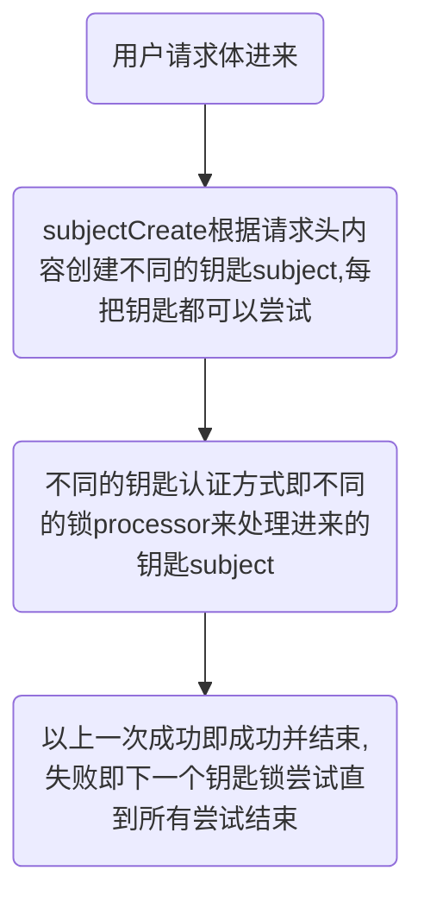

# `sureness`  

[](https://www.apache.org/licenses/LICENSE-2.0.html)   

**如果网站地址访问不了，请使用备用:** [http://tomsun28.gitee.io/sureness](http://tomsun28.gitee.io/sureness)  

[English Documentation](README_EN.md)   

## <font color="green">`Introduction`</font>

> `sureness` 是我们在使用`java`权限框架`shiro`之后,吸取其良好的设计加上一些自己想法实现的全新认证鉴权项目  
>  面对`restful api`的认证鉴权,基于`RBAC`主要关注于对`restful api`的保护  
>  原生支持 `restful api, websocket protection`  
>  原生支持动态权限(权限配置的动态加载)  
>  原生支持 `jwt`, `Basic Auth` ... 可扩展自定义支持的认证方式  
>  [基于改进的字典匹配树大大提高性能](#高性能匹配 )  

>`sureness`的低配置，易扩展，不耦合其他框架，能使开发者对自己的项目多场景快速安全的进行保护   

### 仓库的组成部分:  
- [sureness的核心代码--sureness-core](core)  
- [使用sureness10分钟搭建权限项目--sample-bootstrap](sample-bootstrap)  
- [使用sureness30分钟搭建权限项目--sample-tom](sample-tom)  

## 快速开始  

### <font color="red">使用前一些约定</font>  

- `sureness`尽量简洁,基于`RBAC`,但只有(角色-资源)的映射,没有(权限)动作映射
- 我们将`restful api`请求视作一个资源,资源格式为: `requestUri===httpMethod`  
  即请求的路径加上其请求方式(`post,get,put,delete...`)作为一个整体被视作一个资源  
  `eg: /api/v2/book===get` `get`方式请求`/api/v2/book`接口数据     
- 角色资源映射: 用户所属角色--角色拥有资源--用户拥有资源(用户就能访问此`api`)   

### 项目中加入sureness  

1. 项目使用`maven`构建,加入`maven`坐标  
```
<!-- https://mvnrepository.com/artifact/com.usthe.sureness/sureness-core -->
<dependency>
    <groupId>com.usthe.sureness</groupId>
    <artifactId>sureness-core</artifactId>
    <version>0.0.2.6</version>
</dependency>
```

2. 项目使用`gradle`构建,`gradle`坐标  
```
compile group: 'com.usthe.sureness', name: 'sureness-core', version: '0.0.2.6'
```

3. 项目为普通工程,加入`sureness-core.jar`依赖  

```
在 mvnrepository 下载jar  
https://mvnrepository.com/artifact/com.usthe.sureness/sureness-core
```

### 添加拦截所有请求的过滤器入口  

入口拦截器器实现一般可以是 `filter or spring interceptor`  
在拦截器加入sureness的安全过滤器，如下:  
入口,一般放在拦截所有请求的`filter`:  
  
```
SurenessSecurityManager.getInstance().checkIn(servletRequest)
```

### 实现相关异常处理  

`sureness`使用异常处理流程,我们需要对`checkIn`抛出的异常做自定义处理,  
安全过滤器,认证鉴权成功直接通过,失败抛出特定异常,捕获异常,如下: 

```
        try {
            SubjectSum subject = SurenessSecurityManager.getInstance().checkIn(servletRequest);
        } catch (ProcessorNotFoundException | UnknownAccountException | UnsupportedSubjectException e4) {
            // 账户创建相关异常 
        } catch (DisabledAccountException | ExcessiveAttemptsException e2 ) {
            // 账户禁用相关异常
        } catch (IncorrectCredentialsException | ExpiredCredentialsException e3) {
            // 认证失败相关异常
        } catch (UnauthorizedException e5) {
            // 鉴权失败相关异常
        } catch (RuntimeException e) {
            // 其他自定义异常
        }
```

`sureness`异常                              | 异常描述
---                                       | ---
SurenessAuthenticationException           | 基础认证异常,认证相关的子异常应该继承此异常 
SurenessAuthorizationException            | 基础鉴权异常,鉴权相关的子异常应该继承此异常
ProcessorNotFoundException                | 认证异常,未找到支持此subject的processor
UnknownAccountException                   | 认证异常,不存在此账户
UnSupportedSubjectException               | 认证异常,不支持的请求,未创建出subject
DisabledAccountException                  | 认证异常,账户禁用
ExcessiveAttemptsException                | 认证异常,账户尝试认证次数过多
IncrrectCredentialsException             | 认证异常,密钥错误
ExpiredCredentialsException               | 认证异常,密钥认证过期
UnauthorizedException                     | 鉴权异常,没有权限访问此资源

自定义异常需要继承`SurenessAuthenticationException`或`SurenessAuthorizationException`才能被最外层捕获  

### 加载配置数据  

`sureness`认证鉴权当然也需要我们自己的配置数据:账户数据，角色权限数据等  
这些配置数据可能来自文本，关系数据库，非关系数据库  
我们提供了配置数据接口`SurenessAccountProvider`, `PathTreeProvider`, 用户可以实现此接口实现自定义配置数据源  
当前我们也提供默认文本形式的配置数据实现 `DocumentResourceDefaultProvider`, 用户可以配置`sureness.yml`来配置数据  
```
## -- sureness.yml文本数据源 -- ##

# 加载到匹配字典的资源,也就是需要被保护的,设置了所支持角色访问的资源
# 没有配置的资源也默认被认证保护,但不鉴权
# eg: /api/v2/host===post===[role2,role3,role4] 表示 /api/v2/host===post 这条资源支持 role2,role3,role4这三种角色访问
# eg: /api/v1/getSource3===get===[] 表示 /api/v1/getSource3===get 这条资源支持所有角色或无角色访问
resourceRole:
  - /api/v2/host===post===[role2,role3,role4]
  - /api/v2/host===get===[role2,role3,role4]
  - /api/v2/host===delete===[role2,role3,role4]
  - /api/v2/host===put===[role2,role3,role4]
  - /api/mi/**===put===[role2,role3,role4]
  - /api/v1/getSource1===get===[role1,role2]
  - /api/v2/getSource2/*/*===get===[role2]
  - /api/v1/source1===get===[role2]
  - /api/v1/source1===post===[role1]
  - /api/v1/source1===delete===[role3]
  - /api/v1/source1===put===[role1,role2]
  - /api/v1/source2===get===[]

# 需要被过滤保护的资源,不认证鉴权直接访问
excludedResource:
  - /api/v3/host===get
  - /api/v3/book===get
  - /api/v1/account/auth===post

# 用户账户信息
# 下面有 admin root tom三个账户
# eg: admin 拥有[role1,role2]角色,加盐密码为0192023A7BBD73250516F069DF18B500
# eg: root 没有角色,密码为明文23456
account:
  - appId: admin
    # 如果填写了加密盐--salt,则credential为MD5(password+salt)的32位结果
    # 没有盐认为不加密,credential为明文
    credential: 0192023A7BBD73250516F069DF18B500
    salt: 123
    role: [role1,role2]
  - appId: root
    credential: 23456
    role: [role1]
  - appId: tom
    credential: 32113
    role: [role2]

```

我们提供了使用`DEMO`，默认文本数据源具体实现，请参考[使用sureness10分钟搭建权限项目--sample-bootstrap](https://github.com/tomsun28/sureness/tree/master/sample-bootstrap)   
若权限配置数据来自数据库,请参考[使用sureness30分钟搭建权限项目--sample-tom](https://github.com/tomsun28/sureness/tree/master/sample-tom)  

**HAVE FUN**  

### 进阶扩展  

如果了解 [处理流程](#处理流程),就大概知道`sureness`提供的扩展点    
`sureness`支持自定义`subject`，自定义`subjectCreator`注册，自定义`processor`处理器等  

扩展之前需要了解以下接口:  

- `Subject`: 认证鉴权对象接口,提供访问对象的账户密钥,请求资源,角色等信息  
- `SubjectCreate`: 创建`Subject`接口,根据请求内容创建不同类型的`Subject`对象    
- `Processor`: `Subject`处理接口,根据Subject信息,进行认证鉴权  
- `PathTreeProvider`: 资源的数据源接口,实现从数据库,文本等加载数据  
- `SurenessAccountProvider`: 用户的账户密钥信息接口,实现从数据库,文本等加载数据  

`sureness`大致流程:  



1. **自定义数据源**  

实现 `PathTreeProvider`的接口, 加载到`DefaultPathRoleMatcher`中   
实现 `SurenessAccountProvider`的接口,加载到需要的`processor`中  

2. **自定义subject**  

实现`Subject`接口,添加自定义的`subject`内容  
实现`SubjectCreate`接口方法,创建出自定义的`subject`  
实现`Processor`接口,支持处理自定义的`subject`    

3. **自定义processor**  

一个`subject`当然也可以被不同的`processor`处理,所以可以单独自定义`processor`   
实现`Processor`接口,设置支持的`subject`,实现处理该`subject`的逻辑  


具体扩展实践请参考 [使用sureness30分钟搭建权限项目--sample-tom](sample-tom)  

### 高性能匹配    

  

### 处理流程  

  

### License  
[`Apache License, Version 2.0`](https://www.apache.org/licenses/LICENSE-2.0.html)