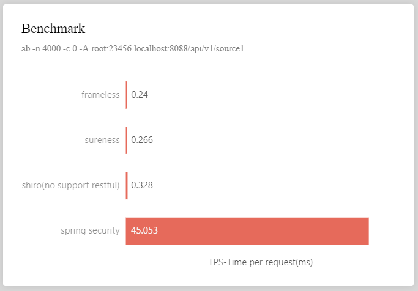

<p align="center">
  <a href="https://su.usthe.com">
    
  </a>
</p>

# <font size="14p">sureness</font>

> A simple and efficient open-source jvm security framework that focus on the protection of restful api.

[](https://www.apache.org/licenses/LICENSE-2.0.html) 
 
[](https://gitter.im/usthe/sureness) 
 

**Please use the space [su.usthe.com](https://su.usthe.com/) when [usthe.com/sureness](https://usthe.com/sureness) cannot accessed.**  

[Chinese Documentation -> 中文文档](README_CN.md)  

## <font color="green">`Introduction`</font>


> Sureness is a new, permission project which we learn from apache shiro and add some ideas to create it.  
> Authentication for restful api, based on RBAC, mainly focused on the protection of restful api.  
> No specific framework dependency(support springboot, quarkus, javalin, ktor and more).    
> Support dynamic modification of permissions.   
> Support mainstream http container(servlet and jax-rs).    
> Supports JWT, Basic Auth, Digest Auth... Can extend custom supported authentication methods.    
> [High performance due dictionary matching tree](#Why Is High Performance ).      
> Good extension interface, demo and document.    

> The low configuration of sureness, easy to expand, and not coupled with other frameworks, enables developers to quickly and safely protect their projects in multiple scenarios.   

##### Compare     

| ~         | sureness | shiro | spring security |
| ---       | ---      | ---   | --- |
| **multi framework support**  | support      | support need modify   | not support |
| **restful api** | support | support need modify   | support |
| **path match**  | dictionary matching tree | ant match | ant match |
| **annotation support**    | support      | support      | support |
| **servlet**    | support      | support      | support |
| **jax-rs**     | support      | not support    | not support |
| **dynamic modification of permissions** | support | support need modify | support need modify |
| **Performance** | Extremely fast | Faster | Slower|

##### Benchmark  

  

**Benchmark tests show that sureness basically does not consume performance compared with frameless applications, 
and the performance (TPS) is twice that of shiro and 170 times that of spring security.**    

Detail see [Benchmark Test](https://github.com/tomsun28/sureness-shiro-spring-security)    

##### Framework Sample Support  

- [x] spring [sample-bootstrap](sample-bootstrap)   
- [x] springboot [sample-tom](sample-tom)  
- [x] quarkus [sample-quarkus](samples/quarkus-sureness)  
- [x] javalin [sample-javalin](samples/javalin-sureness)    
- [x] ktor [sample-ktor](samples/ktor-sureness)   
- [x] spring webflux [sample-spring-webflux](samples/spring-webflux-sureness)   
- [x] more samples todo  

## Quick Start 

#### <font color="red">Some Conventions</font>  

- Based RBAC, only has role-resource, no permission action.    
- We treat restful requests as a resource, resource format like `requestUri===httpMethod`.   
  That is the request uri + request method(`post,get,put,delete...`) is considered as a resource as a whole.  
  `eg: /api/v2/book===get`    
- User belongs some Role -- Role owns Resource -- User can access the resource.  

Resource path matching see: [URI Match](docs/path-match.md)  

#### Add sureness In Your Project  

When use maven or gradle build project, add coordinate  
```
<dependency>
    <groupId>com.usthe.sureness</groupId>
    <artifactId>sureness-core</artifactId>
    <version>0.4.3</version>
</dependency>
```
```
compile group: 'com.usthe.sureness', name: 'sureness-core', version: '0.4.3'
```

#### Use the default configuration to configure sureness  

The default configuration -`DefaultSurenessConfig` uses the document datasource sureness.yml as the auth datasource.  
It supports jwt, basic auth, digest auth authentication.  
```
@Bean
public DefaultSurenessConfig surenessConfig() {
    return new DefaultSurenessConfig();
}
```

#### Load Auth Config DataSource   

Sureness need dataSource to authenticate and authorize, eg: role data, user data etc.  
The dataSource can load from txt, dataBase, no dataBase or annotation etc.  
We provide interfaces `SurenessAccountProvider`, `PathTreeProvider` for user implement to load data from the dataSource where they want.  
`SurenessAccountProvider` - Account datasource provider interface.    
`PathTreeProvider` - Resource uri-role datasource provider interface.     

We provide default dataSource implement which load dataSource from txt(sureness.yml), user can defined their data in sureness.yml.   
We also provider dataSource implement which load dataSource form annotation - `AnnotationLoader`.   

Default Document DataSource Config - sureness.yml, see: [Default Document DataSource](docs/default-datasource.md)   
Annotation DataSource Config Detail, see: [Annotation DataSource](docs/annotation-datasource.md)  

If the configuration resource data comes from text, please refer to  [10 Minute Tutorial's Program--sample-bootstrap](https://github.com/tomsun28/sureness/tree/master/sample-bootstrap)   
If the configuration resource data comes from dataBase, please refer to  [30 Minute Tutorial's Program--sample-tom](https://github.com/tomsun28/sureness/tree/master/sample-tom)   


#### Add an Interceptor Intercepting All Requests  

The essence of `sureness` is to intercept all rest requests for authenticating and Authorizing.     
The interceptor can be a filter or a spring interceptor, it intercepts all request to check them.  
```
SubjectSum subject = SurenessSecurityManager.getInstance().checkIn(servletRequest)
```

#### Implement Auth Exception Handling Process    

`sureness` uses exception handling process:  
1. If auth success, method - `checkIn` will return a `SubjectSum` object containing user information.    
2. If auth failure, method - `checkIn` will throw different types of auth exceptions.   
Users need to continue the subsequent process based on these exceptions.(like return the request response)  

Here we need to customize the exceptions thrown by `checkIn`, 
passed directly when auth success, catch exception when auth failure and do something:    

```
try {
    SubjectSum subject = SurenessSecurityManager.getInstance().checkIn(servletRequest);
} catch (ProcessorNotFoundException | UnknownAccountException | UnsupportedSubjectException e4) {
    // Create subject error related execption 
} catch (DisabledAccountException | ExcessiveAttemptsException e2 ) {
    // Account disable related exception
} catch (IncorrectCredentialsException | ExpiredCredentialsException e3) {
    // Authentication failure related exception
} catch (UnauthorizedException e5) {
    // Authorization failure related exception
} catch (SurenessAuthenticationException | SurenessAuthorizationException e) {
    // other sureness exception
}
```

Detail sureness auth exception see: [Default Sureness Auth Exception](docs/default-exception.md)   

**Have Fun**      

## Advanced Use  

If know sureness Process flow, maybe know these extend points.      

Sureness supports custom subject, custom subjectCreator, custom processor and more.  

Suggest look these interface before extending:  

- `Subject`:  Authenticated authorized  user's account interface, provide the account's username,password, request resources, roles, etc.  
- `SubjectCreate`: create subject interface, provider create method.   
- `Processor`:  process subject interface, where happen authentication and authorization. 
- `PathTreeProvider`: resource data provider, it can load data from txt or database,etc.
- `SurenessAccountProvider`: account data provider, it can load data from txt or database,etc.   

Sureness Process Flow: 

  

1. **Custom Datasource**  

`Implment PathTreeProvider, load in DefaultPathRoleMatcher`   
`Implment SurenessAccountProvide, load in processor`  

2. **Custom Subject**  

`Implment Subject, add custom subject content`  
`Implment SubjectCreate to create custom subject`  
`Implment Processor to support custom subject`    

3. **Custom Processor**  

`A subject also can support by different processor, so we can custom processor to support custom subject`
`Implment Processor, set which subject can support and implment processing details`  

Detail please refer to  [30 Minute Tutorial's Program--sample-tom](sample-tom)   

## Contributing  

Very welcome to Contribute this project, go further and better with sureness. If you have any questions or suggestions about the project code, please contact @tomsun28 directly.  

Components of Repository:  
- [sureness's kernel code--sureness-core](core)  
- [10 Minute Tutorial's Program--sample-bootstrap](sample-bootstrap)  
- [30 Minute Tutorial's Program--sample-tom](sample-tom)  
- [Sample projects using sureness in each framework(javalin,ktor,quarkus)--samples](samples)  


#### Why Is High Performance  

  


## License  
[`Apache License, Version 2.0`](https://www.apache.org/licenses/LICENSE-2.0.html)