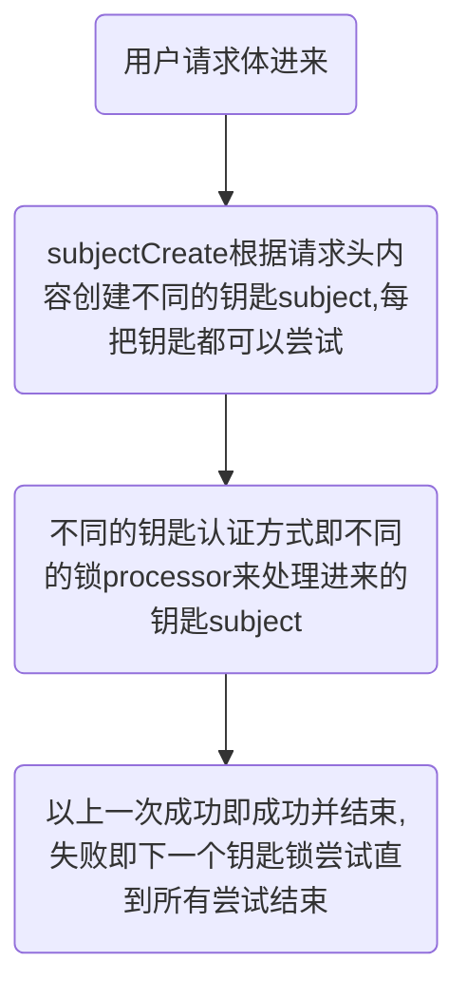

# `sureness`  

[](https://www.apache.org/licenses/LICENSE-2.0.html)   

[English Documentation](README_EN.md) 

## <font color="green">`Background`</font>  

> 目前`java`主流的权限框架有`shiro，spring security`  
> 下面对于它们的探讨都是个人浅薄之见，接受纠正  
> `shiro`对于`restful api`原生支持不是太友好,需要改写一些代码,2年前一个项目就是改造`shiro`,使其在过滤链就能匹配不同的`rest`请求进行权限校验,项目传送门:[booshiro](https://gitee.com/tomsun28/bootshiro),之后给`shiro commit`几次`pr`,`fix`其在过滤链匹配时的危险漏洞,`PR`传送门:[SHIRO-682](https://github.com/apache/shiro/pull/127),总的来说`shiro`很强大但其起源并非面向`web`,对`restful`不是很友好      
> `spring security`很强大,与`spring`深度集成,离开`spring`,比如`google`的精简`guice`,之前用过的`osgi`框架`karaf`就用不了了  
> 它们都会在链式匹配这块，用请求的url和配置的链一个一个`ant`匹配(匹配过程中会有缓存等提高性能)，但匹配的链过多时还是比较耗性能  
> 所以想写一个权限包吸取上面的优秀设计,加一些自己的想法   

## <font color="green">`Introduction`</font>

> `sureness` 是作者在使用`java`权限框架`shiro`之后,吸取其良好的设计加上一些自己想法实现的全新认证鉴权项目  
>  面对`restful api`的认证鉴权,基于`RBAC`主要关注于对`restful api`的保护  
>  原生支持 `restful api, websocket protection`  
>  原生支持动态权限(权限配置的动态加载)  
>  原生支持 `jwt`, `Basic Auth` ... 可扩展自定义支持的认证方式  
>  [基于改进的字典匹配树大大提高性能](#高性能匹配 )  

>`sureness`的低配置，易扩展，不耦合其他框架，能使开发者对自己的项目多场景快速安全的进行保护   

### 仓库的组成部分:  
- [sureness的核心代码--sureness-core](core)  
- [使用sureness10分钟搭建权限项目--sample-bootstrap](sample-bootstrap)  
- [使用sureness30分钟搭建权限项目--sample-tom](sample-tom)  

### <font color="red">一些约定</font>  

- 基于`RBAC`,但只有(角色-资源)的映射,没有(权限)动作
- 我们将`restful api`请求视作一个资源,资源格式为: `requestUri===httpMethod`  
  即请求的路径加上其请求方式(`post,get,put,delete...`)作为一个整体被视作一个资源  
  `eg: /api/v2/book===get` `get`方式请求`/api/v2/book`接口数据     
- 用户所属角色--角色拥有资源--用户拥有资源(用户就能访问此`api`)   


### 使用  

`maven`坐标  
```
<!-- https://mvnrepository.com/artifact/com.usthe.sureness/sureness-core -->
<dependency>
    <groupId>com.usthe.sureness</groupId>
    <artifactId>sureness-core</artifactId>
    <version>0.0.2.6</version>
</dependency>
```

`gradle`坐标  
```
compile group: 'com.usthe.sureness', name: 'sureness-core', version: '0.0.2.6'
```

入口,一般放在拦截所有请求的`filter`:  
```
SurenessSecurityManager.getInstance().checkIn(servletRequest)
```

认证鉴权成功直接通过,失败抛出特定异常,捕获异常: 

```
        try {
            SubjectSum subject = SurenessSecurityManager.getInstance().checkIn(servletRequest);
        } catch (ProcessorNotFoundException | UnknownAccountException | UnsupportedSubjectException e4) {
            // 账户创建相关异常 
        } catch (DisabledAccountException | ExcessiveAttemptsException e2 ) {
            // 账户禁用相关异常
        } catch (IncorrectCredentialsException | ExpiredCredentialsException e3) {
            // 认证失败相关异常
        } catch (UnauthorizedException e5) {
            // 鉴权失败相关异常
        } catch (RuntimeException e) {
            // 其他自定义异常
        }
```

sureness异常                              | 异常描述
---                                       | ---
SurenessAuthenticationException           | 基础认证异常,认证相关的子异常应该继承此异常 
SurenessAuthorizationException            | 基础鉴权异常,鉴权相关的子异常应该继承此异常
ProcessorNotFoundException                | 认证异常,未找到支持此subject的processor
UnknownAccountException                   | 认证异常,不存在此账户
UnSupportedSubjectException               | 认证异常,不支持的请求,未创建出subject
DisabledAccountException                  | 认证异常,账户禁用
ExcessiveAttemptsException                | 认证异常,账户尝试认证次数过多
IncorrectCredentialsException             | 认证异常,密钥错误
ExpiredCredentialsException               | 认证异常,密钥认证过期
UnauthorizedException                     | 鉴权异常,没有权限访问此资源

自定义异常需要继承`SurenessAuthenticationException`或`SurenessAuthorizationException`才能被最外层捕获  


若权限配置数据来自文本,请参考[使用sureness10分钟搭建权限项目--sample-bootstrap](sample-bootstrap)  

若权限配置数据来自数据库,请参考[使用sureness30分钟搭建权限项目--sample-tom](sample-tom)  

HAVE FUN

### 进阶扩展  

如果了解 [处理流程](#处理流程),就大概知道`sureness`提供的扩展点    
`sureness`支持自定义`subject`，自定义`subjectCreator`注册，自定义`processor`处理器等  

扩展之前需要了解以下接口:  

- `Subject`: 认证鉴权对象接口,提供访问对象的账户密钥,请求资源,角色等信息  
- `SubjectCreate`: 创建`Subject`接口,根据请求内容创建不同类型的`Subject`对象    
- `Processor`: `Subject`处理接口,根据Subject信息,进行认证鉴权  
- `PathTreeProvider`: 资源的数据源接口,实现从数据库,文本等加载数据  
- `SurenessAccountProvider`: 用户的账户密钥信息接口,实现从数据库,文本等加载数据  

`sureness`大致流程:  



1. **自定义数据源**  

实现 `PathTreeProvider`的接口, 加载到`DefaultPathRoleMatcher`中   
实现 `SurenessAccountProvider`的接口,加载到需要的`processor`中  

2. **自定义subject**  

实现`Subject`接口,添加自定义的`subject`内容  
实现`SubjectCreate`接口方法,创建出自定义的`subject`  
实现`Processor`接口,支持处理自定义的`subject`    

3. **自定义processor**  

一个`subject`当然也可以被不同的`processor`处理,所以可以单独自定义`processor`   
实现`Processor`接口,设置支持的`subject`,实现处理该`subject`的逻辑  


具体扩展实践请参考 [使用sureness30分钟搭建权限项目--sample-tom](sample-tom)  

### 高性能匹配    

  

### 处理流程  

  

### License  
[`Apache License, Version 2.0`](https://www.apache.org/licenses/LICENSE-2.0.html)