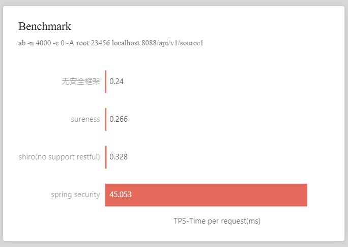
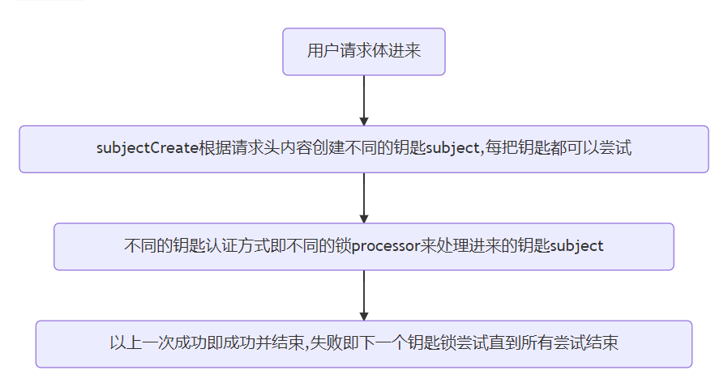

<p align="center">
  <a href="https://su.usthe.com">
    
  </a>
</p>

# <font size="14p">sureness</font> <font size="5p">  | [English Documentation](README.md)</font>

> 面向`REST API`的高性能认证鉴权框架   

[](https://www.apache.org/licenses/LICENSE-2.0.html)
[](https://search.maven.org/artifact/com.usthe.sureness/sureness-core)

[](https://gitter.im/usthe/sureness)

[](https://gitee.com/tomsun28/sureness/stargazers)
[](https://github.com/usthe/sureness)

<a href="https://www.producthunt.com/posts/sureness?utm_source=badge-featured&utm_medium=badge&utm_souce=badge-sureness" target="_blank"></a>

**主页: [usthe.com/sureness](https://usthe.com/sureness), 备用网站: [su.usthe.com](https://su.usthe.com/)**  


## 📫 背景         

在主流的前后端分离架构中，如何通过有效快速的认证鉴权来保护后端提供的`REST API`变得尤为重要。对现存框架，不原生支持`rest`的`apache shiro`，
还是深度绑定`spring`，学习曲线陡峭的`spring security`，或多或少都不是我们的理想型。   
于是乎`sureness`诞生了，我们希望能解决这些，提供一个面向**REST API**，**无框架依赖**，可以**动态修改权限**，**多认证策略**，**更快速度**，**易用易扩展**的认证鉴权框架。      

## 🎡 <font color="green">介绍</font>

> `sureness` 是我们在深度使用权限框架 `apache shiro` 之后,吸取其优点全新设计开发的一个认证鉴权框架  
>  面向 `REST API` 的认证鉴权,基于 `RBAC` (用户-角色-资源)主要关注于对 `API` 的安全保护  
>  无特定框架依赖(本质就是过滤器处拦截判断,已有 `Springboot,Quarkus,Javalin,Ktor,Micronaut` 等集成样例)  
>  支持动态修改权限配置(动态修改配置每个 `API` 谁有权访问)
>  支持 `Websocket` ,主流 `HTTP` 容器 `Servlet` 和 `JAX-RS`  
>  支持多种认证策略, `JWT, Basic auth, Digest auth` ... 可扩展自定义支持的认证方式   
>  [基于改进的字典匹配树拥有的高性能](#高性能匹配 )    
>  良好的扩展接口, 样例和文档助急速理解扩展

>`sureness`的低配置，易扩展，不耦合其他框架，希望能帮助开发者对自己的项目多场景快速安全的进行保护   

##### 🔍 框架对比     

| ~         | sureness | shiro | spring security |
| ---       | ---      | ---   | ---  |
| **多框架支持**  | 支持      | 需改动支持   | 不支持 |
| **REST API** | 支持 | 需改动支持   | 支持 |
| **Websocket** | 支持 | 不支持   | 不支持 |
| **过滤链匹配**  | 优化的字典匹配树 | ant匹配 | ant匹配 |
| **注解支持**    | 支持      | 支持      | 支持 |
| **Servlet**    | 支持      | 支持      | 支持|
| **JAX-RS**     | 支持      | 不支持    | 不支持|
| **权限动态修改** | 支持 | 需改动支持 | 需改动支持|
| **性能速度** | 较快 | 较慢 | 较慢|
| **学习曲线** | 简单 | 简单 | 陡峭|  

##### 📈 基准性能测试  

  

**基准测试显示sureness对比无权限框架应用损耗0.026ms性能，shiro损耗0.088ms,spring security损耗0.116ms，
相比之下sureness基本不消耗性能，且性能(参考TPS损耗)是shiro的3倍，spring security的4倍**     
**性能差距会随着api匹配链的增加而进一步拉大**     
详见[基准测试](https://github.com/tomsun28/sureness-shiro-spring-security)    

##### ✌ 框架支持样例    

- [x] sureness集成springboot样例(配置文件方案) [sample-bootstrap](sample-bootstrap)   
- [x] sureness集成springboot样例(数据库方案) [sample-tom](sample-tom)  
- [x] sureness集成quarkus样例 [sample-quarkus](samples/quarkus-sureness)  
- [x] sureness集成javalin样例 [sample-javalin](samples/javalin-sureness)    
- [x] sureness集成ktor样例 [sample-ktor](samples/ktor-sureness)   
- [x] sureness集成spring webflux样例 [sample-spring-webflux](samples/spring-webflux-sureness)
- [x] sureness集成micronaut样例 [sample-micronaut](samples/micronaut-sureness)  
- [x] sureness使用session样例 [sureness-session](samples/sureness-session)  
- [x] sureness分布式缓存session样例 [sureness-redis-session](samples/sureness-redis-session)  
- [x] more samples todo   


## 🔨 快速开始  

#### 🐕 <font color="red">使用前一些约定</font>  

- `sureness`基于`RBAC`,即用户-角色-资源: 用户所属角色--角色拥有资源(api)--用户就能访问资源(api)  
- 我们将`REST API`请求视作一个资源,资源格式为: `requestUri===httpMethod`  
  即请求的路径加上其请求方式(`post,get,put,delete...`)作为一个整体被视作资源来赋权配置  
  `eg: /api/v2/book===get` `get`方式请求`/api/v2/book`接口数据

资源路径匹配详见 [URI路径匹配](docs/cn/path-match.md)  

#### 🐖 项目中加入sureness  

项目使用`maven`或`gradle`构建,加入坐标    
```
<dependency>
    <groupId>com.usthe.sureness</groupId>
    <artifactId>sureness-core</artifactId>
    <version>1.0.3</version>
</dependency>
```
```
compile group: 'com.usthe.sureness', name: 'sureness-core', version: '1.0.3'
```

#### 🐵 使用默认配置来配置sureness    
默认配置使用了文件数据源`sureness.yml`作为账户权限数据源  
默认配置支持了`JWT, Basic auth, Digest auth`认证  
```
@Bean
public DefaultSurenessConfig surenessConfig() {
    return new DefaultSurenessConfig();
}
```

#### 🐮 配置权限账户数据源      

`sureness`认证鉴权，当然也需要我们提供自己的账户数据，角色权限数据等，这些数据可能来自文本，关系数据库，非关系数据库，注解等。  
我们提供了数据源接口：`SurenessAccountProvider`, `PathTreeProvider`，用户可以实现此接口实现自定义数据源。  

- `PathTreeProvider`: 资源的数据源接口,实现从数据库,文本等加载数据,加载到对应的资源权限匹配器`DefaultPathRoleMatcher`中
- `SurenessAccountProvider`: 用户的账户密钥信息接口,实现从数据库,文本等加载数据，加载到需要账户数据的`processor`中  

当使用的是上方默认配置`DefaultSurenessConfig`时，则默认使用文本数据源和注解数据源作为数据提供者。  

- 文本数据源使用`sureness.yml`配置数据，使用方式详见文档 [默认文本数据源](docs/cn/default-datasource.md)   
- 注解数据源的注解`@RequiresRoles,@WithoutAuth`使用方式详见文档 [注解资源权限数据源](docs/cn/annotation-datasource.md)    

我们提供了代码工程样例：  
默认文本数据源具体实现，请参考[sureness集成springboot样例(配置文件方案)--sample-bootstrap](https://github.com/tomsun28/sureness/tree/master/sample-bootstrap)   
若权限配置数据来自数据库，请参考[sureness集成springboot样例(数据库方案)--sample-tom](https://github.com/tomsun28/sureness/tree/master/sample-tom)  

#### 🐐 添加过滤器拦截所有请求    

`sureness`的本质就拦截所有`API`请求对其认证鉴权判断。  
入口拦截器器实现一般可以是 `filter or spring interceptor`  
在拦截器中加入`sureness`的安全过滤器，如下:  

```
SubjectSum subject = SurenessSecurityManager.getInstance().checkIn(servletRequest)
```

#### 🐰 实现认证鉴权相关异常处理流程      

`sureness`使用异常处理流程：  
1. 若认证鉴权成功,`checkIn`会返回包含用户信息的`SubjectSum`对象  
2. 若中间认证鉴权失败，`checkIn`会抛出不同类型的认证鉴权异常,用户需根据这些异常来继续后面的流程(返回相应的请求响应)

这里我们就需要对`checkIn`抛出的异常做自定义处理,认证鉴权成功直接通过,失败抛出特定异常进行处理,如下:  

```
try {
    SubjectSum subject = SurenessSecurityManager.getInstance().checkIn(servletRequest);
} catch (ProcessorNotFoundException | UnknownAccountException | UnsupportedSubjectException e4) {
    // 账户创建相关异常 
} catch (DisabledAccountException | ExcessiveAttemptsException e2 ) {
    // 账户禁用相关异常
} catch (IncorrectCredentialsException | ExpiredCredentialsException e3) {
    // 认证失败相关异常
} catch (UnauthorizedException e5) {
    // 鉴权失败相关异常
} catch (SurenessAuthenticationException | SurenessAuthorizationException e) {
    // 其他自定义异常
}
```

异常详见 [默认异常类型](docs/cn/default-exception.md)  

**HAVE FUN**  

> 如果这个[快速开始]对您不是很友好，可以参考这篇[一步一步搭建](docs/cn/step-by-step.md)，里面一步一步详细介绍了使用sureness搭建一个完整功能认证鉴权项目的步骤。  

## 🥐 进阶扩展  

`sureness`支持自定义`subject`，自定义`subjectCreator`注册，自定义`processor`处理器等   

进阶自定义扩展之前我们先来了解下sureness的大致流程：  

   

如上面流程，Subject被SubjectCreate根据request请求体所创造，不同的认证鉴权处理器Processor来处理所支持的Subject。  

sureness提供了下面这些常用接口作为扩展点:  

- `Subject`: 认证鉴权对象接口,提供访问对象的账户密钥,请求资源,角色等信息  
- `SubjectCreate`: 创建`Subject`接口,根据请求内容创建不同类型的`Subject`对象    
- `Processor`: `Subject`处理接口,根据Subject信息,进行认证鉴权  
- `PathTreeProvider`: 资源的数据源接口,实现从数据库,文本等加载数据  
- `SurenessAccountProvider`: 用户的账户密钥信息接口,实现从数据库,文本等加载数据  

扩展文档详见 [扩展点](docs/cn/extend-point.md)  

1. 🥊 **自定义subject**  

实现`Subject`接口,添加自定义的`subject`内容  
实现`SubjectCreate`接口方法,自定义subjectCreator创建出自定义的`subject`  
实现`BaseProcessor`接口,自定义processor支持处理自定义的`subject`    
详见 [自定义Subject](docs/cn/custom-subject.md)   

2. 🔫 **自定义subjectCreator**   

实现`SubjectCreate`接口方法,根据request请求的内容创建出对应需要的的`subject`  
详见 [自定义SubjectCreate](docs/cn/custom-subject-creator.md)   

3. 🪓 **自定义processor**  

实现`BaseProcessor`接口,设置支持的`subject`,实现处理该`subject`的认证鉴权逻辑   
详见 [自定义Processor](docs/cn/custom-processor.md)   

4. 🏹 **自定义数据源**  

实现 `PathTreeProvider`的接口, 加载到对应的资源权限匹配器`DefaultPathRoleMatcher`中   
实现 `SurenessAccountProvider`的接口,加载到需要账户数据的`processor`中     
详见 [自定义数据源](docs/cn/custom-datasource.md)   

具体扩展实践请参考 [sureness集成springboot样例(数据库方案)--sample-tom](sample-tom)  


## 🙋 参与贡献  
非常欢迎参与项目贡献，我们致力于维护一个互相帮助的快乐社区。对项目代码有疑问或者建议请直接联系。    

仓库的组成部分:  
- [sureness的核心代码--sureness-core](core)  
- [使用sureness集成springboot搭建权限项目(配置文件方案)--sample-bootstrap](sample-bootstrap)  
- [使用sureness集成springboot搭建权限项目(数据库方案)--sample-tom](sample-tom)  
- [各个框架使用sureness的样例项目(javalin,ktor,quarkus)--samples](samples)  

#### 💪 高性能匹配      

  

## 💡 更多相关     

相关文章：  
[REST API 权限设计 - 初探一](https://segmentfault.com/a/1190000038360856)   
[REST API 权限设计 - 快速搭建权限项目-配置文件方案](https://segmentfault.com/a/1190000039075245)    
[REST API 权限设计 - sureness集成springboot样例-数据库方案](https://segmentfault.com/a/1190000039191172)     

相关视频：  
[bilibili-10分钟搭建一个完整认证鉴权项目，原谅第一次的川普和英语](https://www.bilibili.com/video/bv1EU4y1s7Sz)    

QQ交流群：390083213    
微信公众号：sureness   

## 🌞 开源推荐   

* **```JustAuth```** 小而全而美的第三方登录开源组件: [Gitee](https://gitee.com/yadong.zhang/JustAuth)  
* **```MaxKey```** 业界领先的企业级开源IAM身份管理和身份认证产品: [Gitee](https://gitee.com/dromara/MaxKey)    
* **```PhalApi```** 一个轻量级PHP开源接口框架: [官网](https://www.phalapi.net/)    


## 🛡️ License  
[`Apache License, Version 2.0`](https://www.apache.org/licenses/LICENSE-2.0.html)
