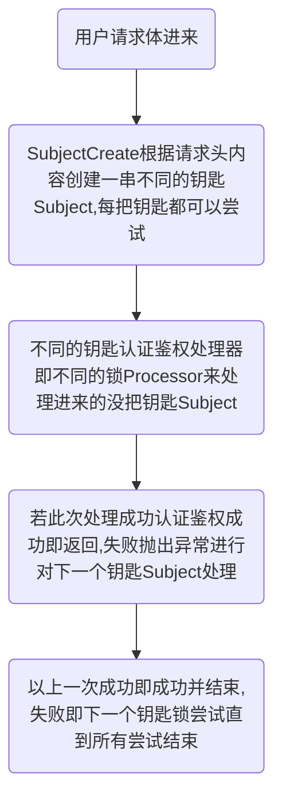

## 进阶扩展  

进阶自定义扩展之前我们先来了解下sureness的大致流程。  

如果了解处理流程,就大概知道`sureness`提供的扩展点    
`sureness`支持自定义`subject`，自定义`subjectCreator`注册，自定义`processor`处理器等 
 
`sureness`的大致流程:  

    

如上面的流程所讲，Subject被SubjectCreate根据request请求体所创造，不同的认证鉴权处理器Processor来处理所支持的Subject。  

sureness提供了下面这些常用接口作为扩展点:  

- `Subject`: 认证鉴权对象接口,提供访问对象的账户密钥,请求资源,角色等信息  
- `SubjectCreate`: 创建`Subject`接口,根据请求内容创建不同类型的`Subject`对象    
- `Processor`: `Subject`处理接口,根据Subject信息,进行认证鉴权  
- `PathTreeProvider`: 资源的数据源接口,实现从数据库,文本等加载数据  
- `SurenessAccountProvider`: 用户的账户密钥信息接口,实现从数据库,文本等加载数据  

`sureness`支持自定义`subject`，自定义注册`subjectCreator`，自定义`processor`处理器，自定义数据源加载器等  

 
 

