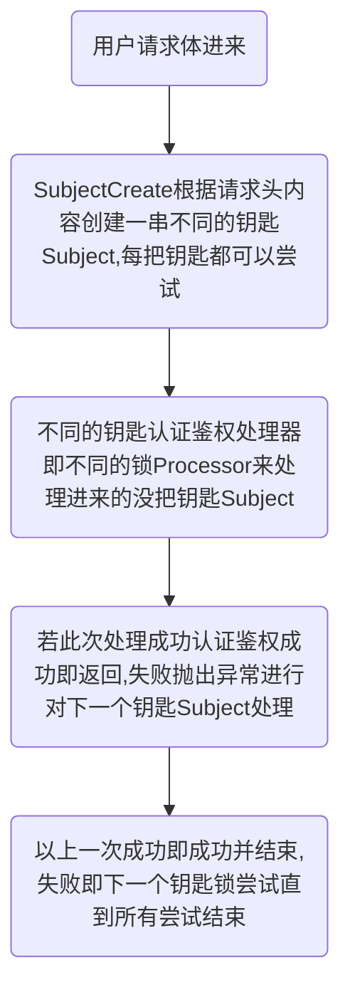

```mermaid
graph TD
A(用户请求体进来) --> B(s)
B(SubjectCreate根据请求头内容创建一串不同的钥匙Subject,每把钥匙都可以尝试) --> C(s)
C(不同的钥匙认证鉴权处理器即不同的锁Processor来处理进来的没把钥匙Subject) --> D(s)
D(若此次处理成功认证鉴权成功即返回,失败抛出异常进行对下一个钥匙Subject处理) --> E(s)
E(以上一次成功即成功并结束,失败即下一个钥匙锁尝试直到所有尝试结束)  
```