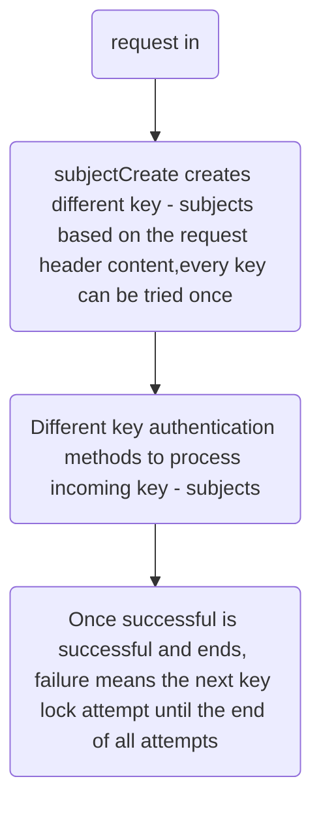

### Why Is High Performance  

  

### Process flow  

```mermaid
graph TD
A(request in) --> B(s)
B(subjectCreate creates different key - subjects based on the request header content,every key can be tried once) --> C(s)
C(Different key authentication methods<differnet lock - processors> to process incoming key - subjects) --> D(s)
D(Once successful is successful and ends, failure means the next key lock attempt until the end of all attempts)
```