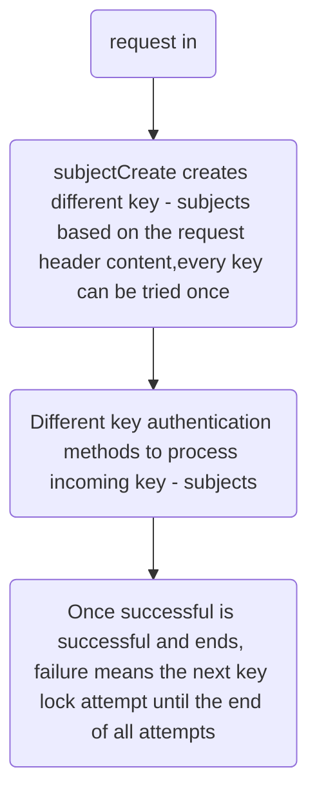

## Advanced Use  

If know sureness Process flow, maybe know the extends point.  
Sureness supports custom subject, custom subjectCreator, custom processor and more.  
Suggest look these interface before extending:  

- `Subject`: Authenticated authorized  user's account interface, provide the account's username,password, request resources, roles, etc.  
- `SubjectCreate`: Create subject interface, provider create method.    
- `Processor`: Process subject interface, where happen authentication and authorization.   
- `PathTreeProvider`: Resource data provider, it can load data from txt or database,etc.  
- `SurenessAccountProvider`: Account data provider, it can load data from txt or database,etc.     

Sureness process flow:    

