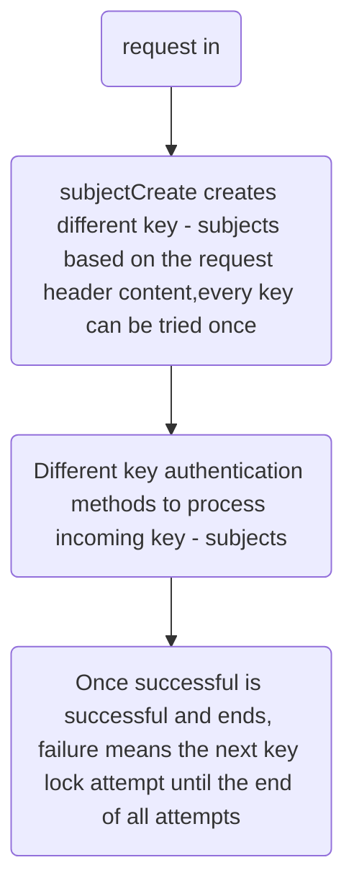

## Advanced Use  

Sureness supports custom subject, custom subjectCreator, custom processor and more.

Before advanced custom extension, let's first understand the general process of sureness:

As in the above process, Subject is created by SubjectCreate according to the request body, and different authentication processors process the supported Subjects.

Sureness provides the following common interfaces as extension points:

- `Subject`: Authenticated authorized  user's account interface, provide the account's username,password, request resources, roles, etc.  
- `SubjectCreate`: Create subject interface, provider create method.    
- `Processor`: Process subject interface, where happen authentication and authorization.   
- `PathTreeProvider`: Resource data provider, it can load data from txt or database,etc.  
- `SurenessAccountProvider`: Account data provider, it can load data from txt or database,etc.     
