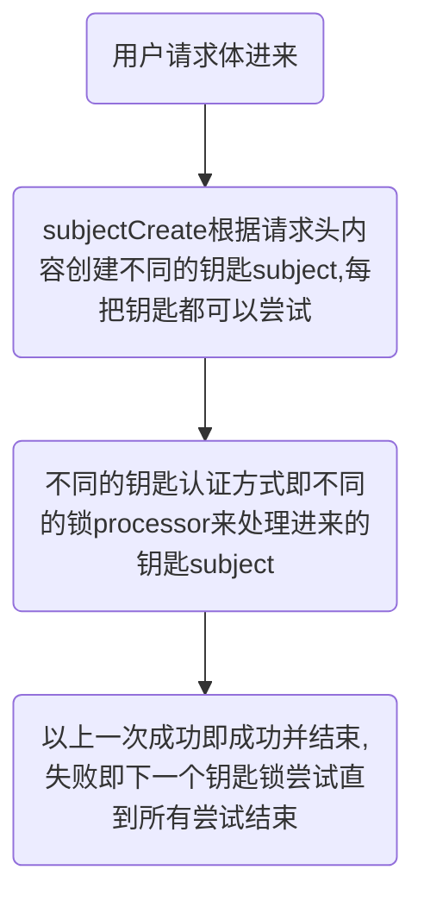

## 进阶扩展  

如果了解处理流程,就大概知道`sureness`提供的扩展点    
`sureness`支持自定义`subject`，自定义`subjectCreator`注册，自定义`processor`处理器等  

扩展之前需要了解以下接口:  

- `Subject`: 认证鉴权对象接口,提供访问对象的账户密钥,请求资源,角色等信息  
- `SubjectCreate`: 创建`Subject`接口,根据请求内容创建不同类型的`Subject`对象    
- `Processor`: `Subject`处理接口,根据Subject信息,进行认证鉴权  
- `PathTreeProvider`: 资源的数据源接口,实现从数据库,文本等加载数据  
- `SurenessAccountProvider`: 用户的账户密钥信息接口,实现从数据库,文本等加载数据  

`sureness`大致流程:  

